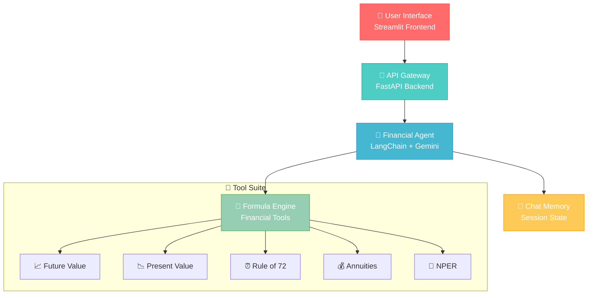

# 💰 Financial Planning Assistant

### _Your AI-powered financial advisor with advanced calculation tools_

<div align="center">


</div>

---

## 🎯 **Project Overview**

The Financial Planning Assistant is an intelligent conversational agent built for **Valura.ai** that helps users create personalized retirement plans through natural language interactions. It combines proven financial formulas with modern AI to deliver clear, actionable financial advice.

### 🚀 **Key Features**

<table>
<tr>
<td width="50%">

#### 🤖 **Intelligent Persona Building**

- Asks 5-8 friendly questions
- Stores user information in memory
- Builds comprehensive financial profile

#### 🧮 **Advanced Formula Engine**

- Future Value & Present Value calculations
- Annuity computations (FV & PV)
- Rule of 72 estimates
- NPER (Number of Periods) calculations

</td>
<td width="50%">

#### 💬 **Natural Language Q&A**

- Understands complex financial questions
- Provides clear numeric answers
- Explains mathematical reasoning

#### 📊 **Interactive Visualizations**

- Real-time calculation animations
- Progress indicators for tool usage
- Responsive chat interface

</td>
</tr>
</table>

---

## 🏗️ **System Architecture**

<div align="center">



</div>

---

## 🛠️ **Tech Stack**

### **Backend Architecture**

<table>
<tr>
<td align="center" width="20%">
<br/>
<strong>FastAPI</strong><br/>
<em>High-performance API</em>
</td>
<td align="center" width="20%">
<br/>
<strong>LangChain</strong><br/>
<em>AI Framework</em>
</td>
<td align="center" width="20%">
<br/>
<strong>Gemini 2.0</strong><br/>
<em>Language Model</em>
</td>
<td align="center" width="20%">
<br/>
<strong>Pydantic</strong><br/>
<em>Data Validation</em>
</td>
<td align="center" width="20%">
<br/>
<strong>Python 3.12+</strong><br/>
<em>Core Language</em>
</td>
</tr>
</table>

### **Frontend Architecture**

<table>
<tr>
<td align="center" width="33%">
<br/>
<strong>Streamlit</strong><br/>
<em>Interactive UI</em>
</td>
<td align="center" width="33%">
<br/>
<strong>CSS Animations</strong><br/>
<em>Visual Effects</em>
</td>
<td align="center" width="33%">
<br/>
<strong>HTML5</strong><br/>
<em>Rich Content</em>
</td>
</tr>
</table>

---

## 📁 **Project Structure**

```
📦 FINANCIAL_PLANNING_APP/
├── 🔧 src/
│   ├── 📱 app.py                     # Streamlit Frontend
│   ├── 🤖 financial_agent.py        # Main AI Agent Logic
│   ├── 🌐 gemini.py                 # Google AI Integration
│   ├── 📝 prompts.py                # System Prompts
│   └── 🔧 tools/
│       ├── 📊 formulas.py            # Financial Calculation Tools
│       └── 🧪 __init__.py
├── 🚀 app/
│   └── 📡 api/
│       └── ⚡ main.py               # FastAPI Backend
├── 🧪 tests/
│   └── 🔬 test_all_formulas.py      # Comprehensive Testing
├── 📋 requirements.txt              # Dependencies
├── 🔒 .env                         # Environment Variables
├── 🐍 .python-version              # Python Version
└── 📖 README.md                    # This File
```

---

## ⚙️ **Installation & Setup**

### **1. Prerequisites**

```bash
# Python 3.12+ required
python --version

# Git for cloning
git --version
```

### **2. Clone Repository**

```bash
git clone https://github.com/your-username/financial-planning-assistant.git
cd financial-planning-assistant
```

### **3. Environment Setup**

```bash
# Create virtual environment
python -m venv .venv

# Activate virtual environment
# Windows:
.venv\Scripts\activate
# macOS/Linux:
source .venv/bin/activate

# Install dependencies
pip install -r requirements.txt
```

### **4. Configuration**

```bash
# Create .env file
echo "GEMINI_API_KEY=your_gemini_api_key_here" > .env
```

### **5. Run the Application**

#### **Start Backend Server:**

```bash
cd app/api
uvicorn main:app --host 127.0.0.1 --port 8000 --reload
```

#### **Start Frontend (New Terminal):**

```bash
cd src
streamlit run app.py
```

---

## 🧮 **Financial Formula Engine**

Our tool suite implements industry-standard financial calculations:

<table>
<tr>
<td width="50%">

### **🔢 Core Formulas**

| Formula           | Implementation                      |
| ----------------- | ----------------------------------- |
| **Future Value**  | `FV = PV × (1 + r)^n`               |
| **Present Value** | `PV = FV ÷ (1 + r)^n`               |
| **FV Annuity**    | `FV = PMT × [((1 + r)^n - 1) ÷ r]`  |
| **PV Annuity**    | `PV = PMT × [1 - (1 + r)^(-n)] ÷ r` |
| **Rule of 72**    | `Years ≈ 72 ÷ rate%`                |
| **NPER**          | `n = ln(FV÷PV) ÷ ln(1+r)`           |

</td>
<td width="50%">

### **🎯 Use Cases**

- 🏠 **Retirement Planning**
- 💳 **Investment Analysis**
- 🎓 **College Savings**
- 🏡 **Mortgage vs Investment**
- 📈 **Portfolio Growth**
- ⏰ **Time-to-Goal Calculations**

</td>
</tr>
</table>

---

## 💬 **Example Interactions**

### **Retirement Planning**

```
User: "I'm 35, save $1000 a month, expect 6% return—what age can I retire?"
Assistant: 🔧 Running calculations...
Result: "Based on your savings plan, you can retire at age 62 with approximately $1.2M.
         This assumes you need 25x your annual expenses for retirement."
```

### **Investment Analysis**

```
User: "What's the future value of $50,000 invested at 7% for 20 years?"
Assistant: 📊 Future Value: $193,484.22 (Principal: $50,000, Rate: 7%, Periods: 20)
```

### **College Savings**

```
User: "How much should I save monthly to have $150,000 in 18 years?"
Assistant: 💰 You need to save $434.85 monthly at 6% annual return to reach $150,000 in 18 years.
```

---

## 🧪 **Testing Framework**

### **Unit Tests Coverage**

- ✅ All financial formulas tested against known values
- ✅ Edge cases (zero rates, negative values)
- ✅ Integration tests for tool chains
- ✅ End-to-end user scenarios

### **Run Tests**

```bash
# Run all tests
python -m pytest tests/ -v

# Run specific test file
python -m pytest tests/test_all_formulas.py -v

# Run with coverage
python -m pytest tests/ --cov=src --cov-report=html
```
